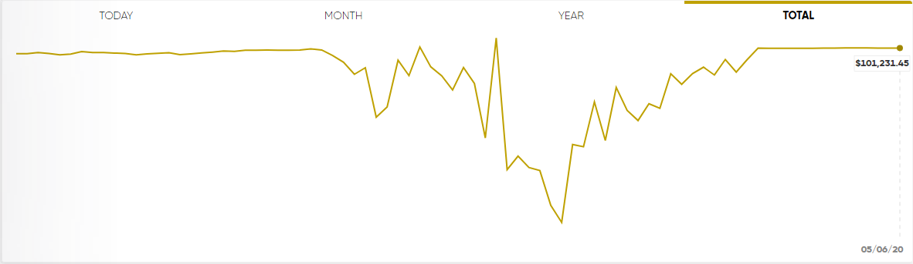
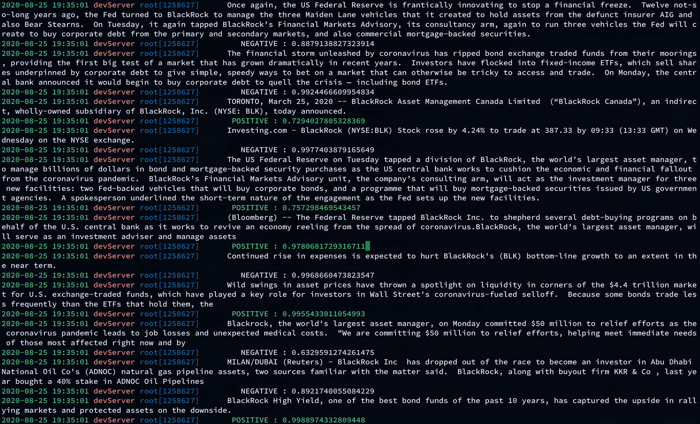

# Trading Bot
[](https://github.com/tamuseanmiller/alpaca-stock-trading-bot/releases)
[](https://github.com/tamuseanmiller/alpaca-stock-trading-bot/blob/master/LICENSE.txt)


This project is a Q-learning based bot that uses historical data to make a working model. After a model has been made the bot uses sentiment analysis of news articles as an extra data point. The bot runs on the Alpaca Stock Trading API and uses the Polygon data from Alpaca as well.

## Results

After giving the bot a $100,000 paper account and letting it run in and around a global pandemic these were the results.



## Downsides

I have no idea how to actually implement Q-learning correctly so it could be very wrong. Please consider reaching out if you have some experience and want to help with it! Also cannot train on old news articles, so sentiment only runs during realtime.

## Data

All data is automatically requested from the Alpaca Barset and Polygon News

## Getting Started

To use this script you have to go out and get a few API keys:

[Make a Funded Alpaca Brokerage Account](https://alpaca.markets/)

Optional now: [Apply for the Natural Language API](https://cloud.google.com/natural-language/)

Optional: [Download MongoDB](https://www.mongodb.com/)

After you finish with these few steps, write down your API keys, you'll need them below.

The next thing you want to do is set up an Ubuntu server. I can write a detailed guide on how to set one up if it's requested enough. I would recommend [Google Cloud Compute VM](https://console.cloud.google.com/compute/) or [AWS EC2 Instance](https://aws.amazon.com/). Once you have that up and running you want to set your environmental variables you can do this by inputting this in console (Fill in your information).

```bash
# Were I you I would use the URL for paper-trading to start
export APCA_API_BASE_URL=BASE_API_URL
export APCA_API_KEY_ID=YOUR_API_KEY_ID
export APCA_API_SECRET_KEY=YOUR_SECRET_KEY
export GOOGLE_APPLICATION_CREDENTIALS=PATH_TO_CREDENTIALS_FILE
```

After this, open up creds.py and add in your url.

```bash
# Add Info
mongoInfo = ""

client = pymongo.MongoClient(mongoInfo)
```

Install python

```bash
sudo apt-get update
sudo apt-get install python 3.6
sudo apt-get -y install python3-pip
sudo apt install python-pip
pip install --upgrade pip
```

I tried to make the use of this project as simple as possible and you only need a few commands to set it up. Most of the packages you need to install are from the requirements.txt file. If there are any libraries that don't install, just install which imports give you an error when you first start the script.

```bash
pip3 install -r requirements.txt
```

Now you can begin training. The bot automatically grabs the data in 1 minute periods, all it needs is the name of the model to be saved and which stock ticker that you want to train it off of. Basically the script makes several api calls to fill the training.csv data file with the last 'n' years of stock data. After it fills training.csv, it will then create test.csv which will act as the last 10 days of data. The basic structure is:

```bash
python3 train.py <months> [--window-size=<window-size>] [--batch-size=<batch-size>] [--episode-count=<episode-count>] [--model-name=<model-name>] [--pretrained] [--stock-name=<stock-name>] [--debug]
```


Example Usage:

```bash
python3 train.py 12 --window-size=10 --episode-count=10 --model-name=model_alpha --stock_name=AMD --pretrained --debug
```

I think the rest is pretty self explanatory.

Once you're done training, run the eval script or just run the entire bot:

```bash
eval.py eval.py <eval-stock> [--window-size=<window-size>] [--model-name=<model-name>] [--run-bot] [--db-name=<db-name>] [--stock-name=<stock-ticker>] [--natural-lang] [--debug] [--mongo]
```


Example Usage:

```bash
python3 eval.py test --window-size=10 --db-name=stocks --model-name=model_alpha --run-bot --stock-name=GOOGL --mongo --debug
```

Now everything should be good to go!

## Extra Tidbits of Useful Information

* The sentiment analysis of news runs by default off of Flair, you can enable Google's Natural Language just by adding the '--natural-lang' command.

* To add MongoDB functionality add the '--db-name' and '--mongo' flags.

* News runs off of the NewsAPI and Polygon news.

* If the bot runs continually day to day, it will continue learning over time with more trades.


## Photos

I thought the logging on the sentiment analysis looked quite clean.




## Credits

All credit for the Q-learning aspect of this bot and general outline is directly forked from [pskrunner14's Bot](https://github.com/pskrunner14/trading-bot)

Using Google's Natural Language API for Sentiment Analysis a copy of their license can be found [here](http://www.apache.org/licenses/LICENSE-2.0)
